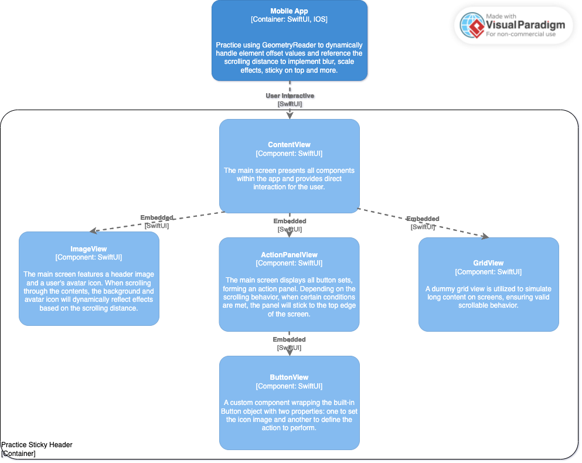

# Practice Sticky Header

The app is solely for learning purposes, demonstrating the concept of wrapping elements in the built-in GeometryReader. This allows us to obtain corresponding geometry information and create interactive effects based on user gestures.

## C4 Model - Component Diagram Only

## Screenshots
https://github.com/Zuexx/practice-sticky-header/assets/6257123/8ffeb2dc-f563-4369-87dd-e12c481cb1df

## Features

- ### Header background scale effect
  - A scaling effect that varies based on the user's scrolling distance.
- ### Header background blur effect
  - A blur effect that varies based on the user's scrolling distance.
- ### Header background always snapped to the top edge of the screen
  - Dynamically adjusts the y-axis offset of the header background based on the user's scrolling distance.
- ### Avatar position remains aligned with the original position relative to the header background.
  - Dynamically adjusts the y-axis offset of the avatar based on the user's scrolling distance.

## Requirements

- iOS 17.0
- Xcode 15.3

## Usage

1. Clone or download the repository.
2. Open the project in Xcode.
3. Configure the project with your own apple id.
4. Build and run the app on a simulator or physical device.

## License

This project is licensed under the MIT License - see the [LICENSE](LICENSE) file for details
